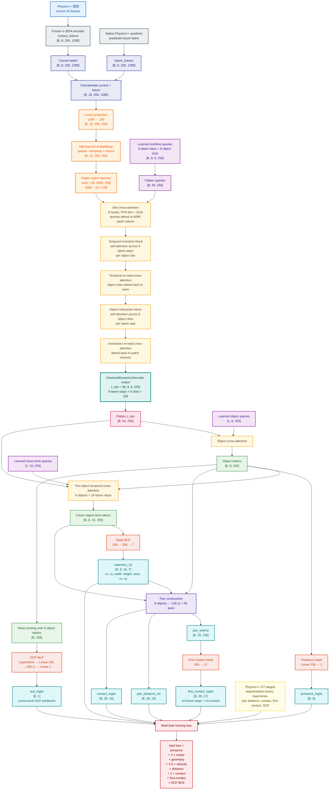

```mermaid
flowchart TD

    A["Physion++ 视频<br/>current 16 frames"]:::input
    B["Frozen V-JEPA encoder<br/>context_tokens<br/>[B, 8, 256, 1280]"]:::frozen
    C["Native Physion++ predictor<br/>predicted future latent"]:::frozen
    D["future_tokens<br/>[B, 8, 256, 1280]"]:::latent

    A --> B
    B --> E
    C --> D

    E["Current latent<br/>[B, 8, 256, 1280]"]:::latent

    E --> F
    D --> F

    F["Concatenate current + future<br/>[B, 16, 256, 1280]"]:::latent
    F --> G

    G["Linear projection<br/>1280 → 256<br/>[B, 16, 256, 256]"]:::decoder
    G --> H

    H["Add learned embeddings<br/>spatial + temporal + source<br/>[B, 16, 256, 256]"]:::decoder
    H --> I

    I["Flatten patch memory<br/>mem = [B, 4096, 256]<br/>4096 = 16 × 256"]:::decoder
    I --> J

    Q["Learned slot/time queries<br/>8 latent steps × 8 object slots<br/>[B, 8, 8, 256]"]:::query
    Q --> K

    J["Slot cross-attention<br/>8 heads, FFN dim = 1024<br/>queries attend to 4096 patch tokens"]:::attention
    K["Flatten queries<br/>[B, 64, 256]"]:::query

    K --> J
    J --> L

    L["Temporal transition block<br/>self-attention across 8 latent steps<br/>per object slot"]:::attention
    L --> M

    M["Temporal re-read cross-attention<br/>object slots attend back to mem"]:::attention
    M --> N

    N["Object interaction block<br/>self-attention across 8 object slots<br/>per latent step"]:::attention
    N --> O

    O["Interaction re-read cross-attention<br/>attend back to patch memory"]:::attention
    O --> P

    P["UniversalDynamicsDecoder output<br/>z_dyn = [B, 8, 8, 256]<br/>8 latent steps × 8 slots × 256"]:::z

    P --> R
    R["Flatten z_dyn<br/>[B, 64, 256]"]:::probe

    OQ["Learned object queries<br/>[1, 8, 256]"]:::query
    OQ --> S

    S["Object cross-attention"]:::attention
    R --> S
    S --> T

    T["Object tokens<br/>[B, 8, 256]"]:::feature
    T --> U

    UQ["Learned future-time queries<br/>[1, 16, 256]"]:::query
    UQ --> U

    U["Per-object temporal cross-attention<br/>8 objects × 16 future steps"]:::attention
    R --> U
    U --> V

    V["Future object-time tokens<br/>[B, 8, 16, 256]"]:::feature
    V --> W

    W["State MLP<br/>256 → 256 → 7"]:::head
    W --> X

    X["trajectory_2d<br/>[B, 8, 16, 7]<br/>cx, cy, width, height, area, vx, vy"]:::output

    T --> Y
    Y["Presence head<br/>Linear 256 → 1"]:::head
    Y --> Z

    Z["presence_logits<br/>[B, 8]"]:::output

    V --> AA
    T --> AA
    X --> AA

    AA["Pair construction<br/>8 objects → C(8,2) = 28 pairs"]:::pair
    AA --> AB
    AA --> AC
    AA --> AD

    AB["pair_tokens<br/>[B, 28, 256]"]:::output
    AC["pair_distance_2d<br/>[B, 28, 16]"]:::output
    AD["contact_logits<br/>[B, 28, 16]"]:::output

    AB --> AE
    AE["First-contact head<br/>256 → 17"]:::head
    AE --> AF

    AF["first_contact_logits<br/>[B, 28, 17]<br/>16 future steps + no-contact"]:::output

    T --> AG
    AG["Mean pooling over 8 object tokens<br/>[B, 256]"]:::feature
    AG --> AH

    AH["OCP MLP<br/>LayerNorm → Linear 256 → GELU → Linear 1"]:::head
    AH --> AI

    AI["ocp_logits<br/>[B, 1]<br/>scene-level OCP prediction"]:::output

    GT["Physion++ GT targets<br/>segmentation boxes, trajectories,<br/>pair distance, contact, first-contact, OCP"]:::target

    X --> LOSS
    Z --> LOSS
    AC --> LOSS
    AD --> LOSS
    AF --> LOSS
    AI --> LOSS
    GT --> LOSS

    LOSS["Multi-task training loss"]:::loss
    LOSS --> LOSS2["total loss =<br/>presence<br/>+ 2 × center<br/>+ geometry<br/>+ 0.5 × velocity<br/>+ distance<br/>+ 2 × contact<br/>+ first-contact<br/>+ OCP BCE"]:::loss

    classDef input fill:#E3F2FD,stroke:#1565C0,color:#0D47A1,stroke-width:2px;
    classDef frozen fill:#ECEFF1,stroke:#455A64,color:#263238,stroke-width:2px;
    classDef latent fill:#E8EAF6,stroke:#3949AB,color:#1A237E,stroke-width:2px;
    classDef decoder fill:#FFF3E0,stroke:#EF6C00,color:#E65100,stroke-width:2px;
    classDef query fill:#F3E5F5,stroke:#8E24AA,color:#4A148C,stroke-width:2px;
    classDef attention fill:#FFF8E1,stroke:#F9A825,color:#5D4037,stroke-width:2px;
    classDef z fill:#E0F2F1,stroke:#00897B,color:#004D40,stroke-width:3px;
    classDef probe fill:#FCE4EC,stroke:#D81B60,color:#880E4F,stroke-width:2px;
    classDef feature fill:#E8F5E9,stroke:#43A047,color:#1B5E20,stroke-width:2px;
    classDef head fill:#FBE9E7,stroke:#E64A19,color:#BF360C,stroke-width:2px;
    classDef pair fill:#EDE7F6,stroke:#5E35B1,color:#311B92,stroke-width:2px;
    classDef output fill:#E0F7FA,stroke:#00838F,color:#006064,stroke-width:2px;
    classDef target fill:#FFFDE7,stroke:#FDD835,color:#5F4C00,stroke-width:2px;
    classDef loss fill:#FFEBEE,stroke:#C62828,color:#7F0000,stroke-width:2px;
```