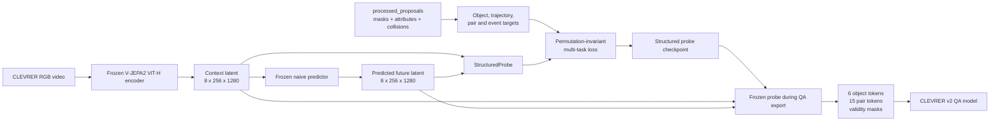
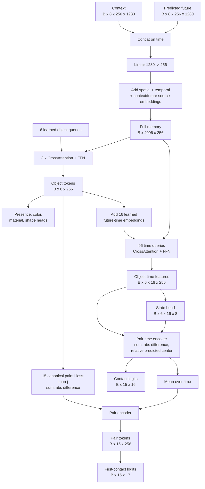
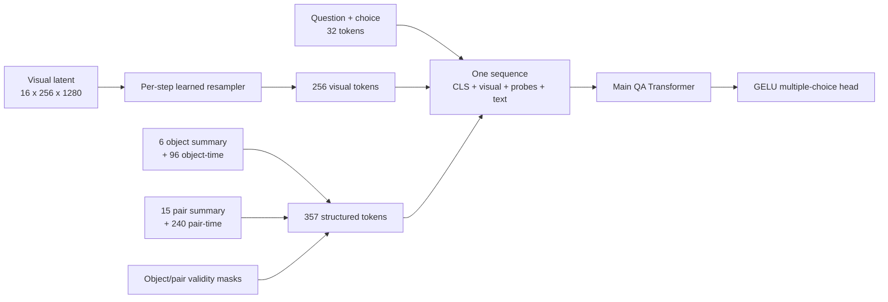

# CLEVRER Full-Patch Dynamics Decoder v5

本文档描述 v5 中 `decoder_0810` 风格的通用 dynamics decoder、CLEVRER shallow probes、监督方法、训练协议，以及它如何接入 CLEVRER v2 QA。通用 decoder 输出 `z_dyn [B,8,8,256]`；CLEVRER probes 只能读取 `z_dyn`，并将 8 个 decoder 时间位置展开为 16 个监督时间点。

## 1. 研究目标

已有 naive world model 接收 16 帧 context，并预测后续 16 帧对应的 latent。旧 probe 先把每个时刻的 256 个 patch token 压缩成少量全局特征，容易丢失对象位置、遮挡、碰撞等局部信息。本实验保留：

- context latent：`[B, 8, 256, 1280]`
- predictor future latent：`[B, 8, 256, 1280]`
- 合并后的 full-patch memory：`[B, 4096, 256]`

decoder 不重建 future latent，而是产生物理动力学表示。CLEVRER shallow probes 再将其读出为 6 个 object tokens、15 个 canonical object-pair tokens，以及属性、轨迹和碰撞输出。

## 2. 总体数据流

当前实现的 decoder 主干为：

```text
full-patch memory
  -> time-indexed dynamics slot cross-attention
  -> per-slot temporal transition self-attention + memory reread
  -> per-time interaction self-attention + memory reread
  -> z_dyn [B,8,8,256]
```

随后 CLEVRER shallow probes 只读取 `z_dyn`，生成保持 v1 评估/QA
接口兼容的 6 个对象、16-step state 和 15 个 pair 输出。



world encoder、naive predictor 在训练中完全冻结。训练参数属于通用 decoder 和 CLEVRER shallow probes；shallow probes 不允许读取 full-patch memory。

## 3. 时间协议与 latent cache

v5 默认按视频生成三个独立窗口，窗口起点为 `0,32,64`。每个窗口使用
16 个 current 帧和 16 个 future 帧，cache/target 通过 `(scene_id,
window_start)` 对齐；train/validation 仍先按视频 split，再在 split 内展开窗口。

probe 训练 cache 对每个视频使用固定窗口，不做随机裁剪：

| 内容 | 原始帧索引 | 编码后形状 |
| --- | --- | --- |
| context RGB | `0, 2, ..., 30`，共 16 帧 | `[8, 256, 1280]` |
| future target 时间 | `32, 34, ..., 62`，共 16 帧 | 仅用于生成监督标签 |
| predicted future latent | predictor 读取 context latent 后生成 | `[8, 256, 1280]` |

16 个 RGB 帧经过 tubelet size 2 的 encoder 后形成 8 个 temporal latent steps，每个 step 有 `16 x 16 = 256` 个空间 patch tokens。future 输入是 predictor 的预测结果，不是真实 future RGB 的 encoder latent，因此 probe 不能从真实未来图像泄漏信息。

cache 以 FP16 持久化；训练时模型在 GPU 上使用 BF16 autocast。进入 probe 的 token 网格仍完整保留，没有空间池化或 token 数量压缩。

使用的 predictor checkpoint 是：

```text
/data/shyang/outputs/vjepa2-baiz/vjepa2_naive/
clevrer_vith_16to16_stride2_8gpu/best.pt
```

## 4. 监督标签

标签来自 `processed_proposals/sim_XXXXX.json`，而不是 QA annotations。proposal 通过 `(color, material, shape)` 三元组与 ground-truth object 对齐，同一对象同一帧存在多个 proposal 时保留最高分且分数至少为 0.5 的 proposal。

每个 scene 最多 6 个对象。由 future 帧 `32, 34, ..., 62` 的 mask 产生：

| Target | 形状 | 含义 |
| --- | --- | --- |
| `object_present` | `[6]` | object slot 是否对应真实对象 |
| `color` | `[6]` | 8 类颜色 |
| `material` | `[6]` | rubber / metal |
| `shape` | `[6]` | cube / cylinder / sphere |
| `state` | `[6,16,8]` | 每个对象的 16-step 状态 |
| `state_valid` | `[6,16]` | 对应 proposal mask 是否有效 |
| `pair_distance` | `[6,6,16]` | 两对象中心点的归一化欧氏距离 |
| `pair_valid` | `[6,6,16]` | 两对象在该时刻是否都有效 |
| `contact` | `[6,6,16]` | GT collision 是否落入该时间 bin |
| `contact_valid` | `[6,6,16]` | contact 监督是否有效 |
| `first_contact_class` | `[6,6]` | 首次碰撞 bin `0..15`，`16` 表示不碰撞 |

`state` 的 8 个通道依次是：

```text
center_x, center_y, mask_area, bbox_width, bbox_height,
velocity_x, velocity_y, log_mask_area
```

位置、面积、宽高均按图像尺寸归一化。速度是相邻采样帧中心位置之差；第一个 future step 使用前一个采样帧估计速度。缺失 proposal 的时刻通过 validity mask 排除，不进行数值补标签。

## 5. Probe 架构

默认超参数：`hidden_dim=256`、8 attention heads、3 个 object cross-attention blocks、FFN 维度 1024、dropout 0.1。按该配置，probe 共有 3,971,624 个可训练参数；冻结的 encoder 和 predictor 不计入其中。



### 5.1 Full-patch memory

context 和 future 沿 temporal 维拼成 `[B,16,256,1280]`，经过 `Linear(1280,256)` 后加入三种 learned embedding：

- 256 个空间位置 embedding；
- 16 个 temporal step embedding；
- context / predicted-future source embedding。

随后 reshape 为 `[B,4096,256]`。所有 object queries 和 object-time queries 都直接 cross-attend 这 4096 个 tokens。

### 5.2 Object decoder

6 个 learned object queries 经过 3 层 pre-norm cross-attention block。每层包含：

1. query 和 memory 分别 LayerNorm；
2. multi-head cross-attention；
3. residual；
4. LayerNorm、两层 GELU FFN、residual。

得到的 `[B,6,256]` object tokens 同时服务于属性监督和后续 pair 建模。

### 5.3 Object-time decoder

每个 object token 与 16 个 learned future-time embeddings 相加，形成 96 个 queries。它们再次读取同一 full-patch memory，得到 `[B,6,16,256]` object-time features，再由 MLP 输出 8 维状态。

注意 predictor 产生 8 个 temporal latent tokens，而 probe 输出 16 个监督时间点。16-step 轨迹不是把 predictor token 一一线性映射出来，而是由 96 个带时间 embedding 的 queries 从完整 context/future memory 中解码。

### 5.4 Canonical pair decoder

6 个对象按 `i < j` 产生 `C(6,2)=15` 个 canonical pairs，不另外建立 `(j,i)`。object-level 和 time-feature-level 组合使用：

- `object_i + object_j`
- `abs(object_i - object_j)`
- 对应 time feature 的 sum 和 absolute difference
- 有符号的预测中心相对位置 `center_i - center_j`

前两种组合在交换对象后保持不变，但有符号相对位置会改变符号。因此当前实现避免了 `(i,j)` / `(j,i)` 两套冗余 token，却不是严格的交换对称网络。每时刻的 pair-time feature 预测 contact；其时间均值与两个 object token 的组合一起生成一个 pair token，并预测 17 类 first-contact/no-contact。

## 6. 对象匹配与损失

learned object queries 没有固定 object ID，因此训练前先做 sample-local 的离散匹配。最多只有 6 个对象，代码直接枚举 predicted slots 的排列并选择总代价最小的精确 assignment；这是置换不变的最小二分匹配，但实现上没有调用外部 Hungarian solver。

匹配代价包含：

- presence probability；
- color、material、shape 的负对数概率；
- validity-aware 的 center、area、bbox 几何轨迹 L1 代价，其中 center 权重更高。

assignment 在 `no_grad` 下计算。匹配完成后才计算可微训练损失：

```text
L = L_presence
  + L_attributes
  + 2.0 * L_center
  + 1.0 * L_geometry
  + 0.5 * L_velocity
  + 0.1 * L_log_area
  + 1.0 * L_distance
  + 2.0 * L_contact
  + 1.0 * L_first_contact
```

- `presence`、`contact` 使用 BCE-with-logits；
- color/material/shape 和 first contact 使用 cross entropy；
- 连续状态和 pair distance 使用 Smooth L1；
- contact 的正样本权重按当前 batch 动态计算，最大截断为 100；
- state、distance、contact 都应用对应 validity mask。

## 7. 训练方法

默认训练协议：

| 设置 | 默认值 |
| --- | --- |
| train scenes | 0-9999 |
| validation scenes | 10000-14999 |
| epochs | 30 |
| global execution | 8-GPU DDP |
| batch size | 每 GPU 1 scene |
| optimizer | AdamW |
| learning rate | `2e-4` |
| weight decay | `0.04` |
| scheduler | cosine annealing |
| gradient clipping | `1.0`，非有限 gradient 立即失败 |
| training compute dtype | BF16 autocast |
| seed | 239 |

train 使用标准 `DistributedSampler` 并逐 epoch 改变 shuffle seed；validation 使用 `ExactDistributedSampler`，避免补齐样本造成重复统计。各 rank 的 validation loss 按样本数 all-reduce。以 validation `total` loss 最低的 epoch 保存 `best.pt`，每个 epoch 同时更新 `latest.pt` 和 `history.json`。

## 8. 输出及 checkpoint

probe checkpoint protocol 为：

```text
clevrer_fullpatch_structured_probe_v1
```

checkpoint 包含 model state、可重建的 model config、optimizer、scheduler、epoch、validation metrics、随机种子和 cache/target 路径。默认目录名是：

```text
clevrer_structured_probe_seed239_stable_v2/
```

pair distance 使用 FP32 `vector_norm`，使两个预测中心完全重合时的梯度保持有限。模型输出、各项 loss 和 gradient 都有 finite check；一旦发现 NaN/Inf，训练会记录对应 scene ID 并立即失败，不再继续写出被污染的 checkpoint。

公开 shell 支持 `--output-mode both|data|workspace`，默认 `workspace`；该参数只改变 artifact 与日志的保存位置，不改变实验定义。

## 9. 接入 CLEVRER v2 QA

QA export 阶段重新在线运行冻结的 encoder、naive predictor 和训练好的 probe，当前配置只评测 predictive questions。此时 current window 位于视频后段；导出的 visual trajectory 仍是：

```text
visual_tokens: [16,256,1280]
               = 8 current temporal tokens + 8 predicted-future temporal tokens
```

probe adapter 另外导出训练时受监督的 structured predictions：

```text
object_tokens:         [6,256]
presence_logits:       [6]
color_logits:          [6,8]
material_logits:       [6,2]
shape_logits:          [6,3]
trajectory_2d:         [6,16,8]
pair_tokens:           [15,256]
pair_distance_2d:      [15,16]
contact_gt_event:      [15,16]
first_contact_logits:  [15,17]
object_valid:          [6]
pair_valid:            [15]
```

presence sigmoid 以 0.5 为阈值产生 `object_valid`。若少于两个 object slots 通过阈值，则保留 presence logits 最高的两个，保证至少存在一个有效 pair token。

QA 模型对每个 temporal step 的 256 个 patch tokens 用 16 个 learned resampler queries 压成 16 tokens，因此主序列包含 `16 x 16 = 256` 个视觉 tokens。structured readout 使用 `structured_supervised_sequence_v2`，将 probe 监督输出编码成四组 token：

```text
object summary:      6 tokens   = object token + presence/attribute logits
object future state: 96 tokens  = 6 objects x 16 future steps x 8-D state
pair summary:        15 tokens  = pair token + first-contact logits
pair future state:   240 tokens = 15 pairs x 16 future steps x (distance, contact)
total:               357 tokens
```

四组 probe tokens 与 current+future visual tokens、question/choice tokens 进入同一个 QA Transformer：



完整 predictive QA 序列长度为 `1 + 256 + 357 + 32 = 646`。无效 object/pair 及其 time tokens 通过 Transformer padding mask 屏蔽。该路径不再使用 Transformer 之后的 probe residual gate；QA head 使用 GELU，配置学习率为 `1e-4`，以降低大序列 readout 的优化塌缩风险。

## 10. 方法边界

- object slots 的语义由监督匹配产生，不保证跨 scene 具有固定 slot ID。
- proposal 与 GT object 依赖唯一的 `(color, material, shape)` 三元组；出现重复属性组合时 target 生成会明确失败。
- 轨迹监督来自 proposal mask，proposal 缺失或质量较差会直接影响 state validity 和训练覆盖率。
- contact 使用稀疏碰撞事件，类别高度不均衡；动态 positive weight 只能缓解，不能消除该问题。
- pair distance 是预测中心坐标的派生量，并非独立回归 head，因此它会直接约束 object trajectory 的空间一致性。
- pair 只取 `i < j`，但 pair-time encoder 使用有符号的 `center_i - center_j`；它没有重复 pair，却也不具备严格的交换不变性。
- probe 训练固定使用视频前段，而 QA 在线导出使用后段 current window；二者共享相同时间跨度和 stride，但存在绝对时间位置分布差异。
- 当前最优 checkpoint 按总 validation loss 选择，不按单独的 object、trajectory、contact 指标选择。

## 11. 代码索引

| 文件 | 作用 |
| --- | --- |
| `scripts/clevrer/prepare_targets.py` | 从 proposal masks 和 GT collisions 生成监督标签 |
| `scripts/clevrer/cache_full_latents.py` | 冻结 encoder/predictor，缓存完整 context/future patch latent |
| `scripts/clevrer/model.py` | structured probe、对象匹配和多任务 loss |
| `scripts/clevrer/train_structured_probe.py` | DDP 训练、验证和 checkpoint 保存 |
| `scripts/clevrer/probe_adapter.py` | QA export 时加载冻结 probe 并导出 structured outputs |
| `scripts/clevrer/run_all.sh` | 顺序运行 targets、cache、probe training |
| `scripts/clevrer/qa_eval_8gpu.sh` | 启动 CLEVRER v2 QA export/train/eval |
