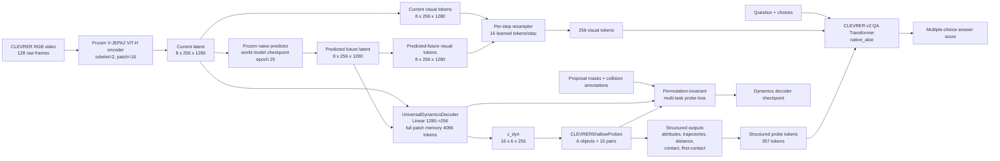
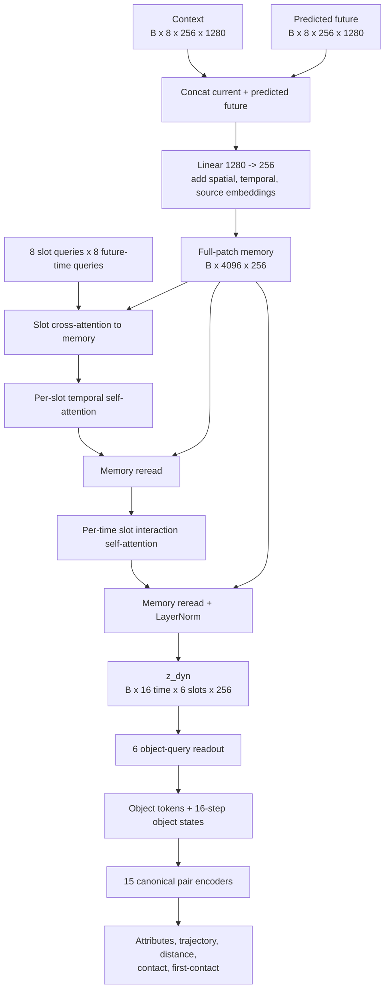
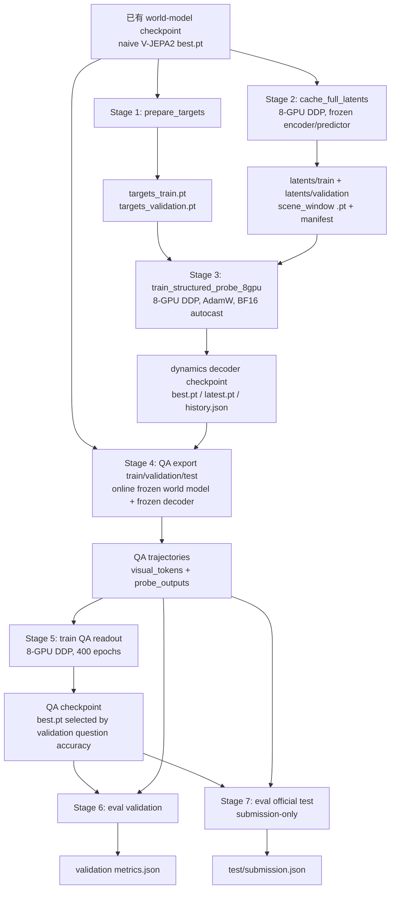

# v5 Dynamics Decoder：方法框架与训练流程

本文档对应当前实验 run：

```text
outputs/runs/vjepa2_naive_probe_v5_decoder/
  clevrer_vith_16to16_dynamics_decoder_v1_8gpu/
```

目标是验证：冻结的 V-JEPA2 naive world model 产生的 current/future patch
latent，经过一个可训练的 dynamics decoder 后，是否能提供比 visual-only
readout 更适合 CLEVRER predictive QA 的结构化动力学表示。

本文只描述当前 recipe 中实际实现的路径。已有的网络细节、target 定义和
损失公式见 [`probe_architecture.md`](probe_architecture.md)。

## 1. 一句话概括

该方法不是端到端微调整个 V-JEPA2，而是分成两个冻结边界和两个训练阶段：

1. 冻结 V-JEPA2 encoder + naive predictor，生成完整的 current/future patch latent；
2. 训练 `UniversalDynamicsDecoder + CLEVRERShallowProbes`，把 patch latent 转成对象、轨迹、pair 和碰撞事件表示；
3. 冻结 world model 与 dynamics decoder，把这些表示作为额外 token 接入 CLEVRER v2 QA Transformer；
4. 单独训练 QA readout，并在 validation 上选择最优 QA checkpoint。

因此，最终 QA 的梯度不会回传到 V-JEPA2 world model，也不会回传到已经训练好的 dynamics decoder。

## 2. 总体框架



### 冻结与可训练边界

| 组件 | 作用 | probe 训练 | QA 训练 |
| --- | --- | --- | --- |
| V-JEPA2 ViT-H encoder | RGB → current latent | 冻结 | 冻结 |
| naive predictor | current latent → predicted future latent | 冻结 | 冻结 |
| `UniversalDynamicsDecoder` | full-patch latent → `z_dyn` | 训练 | 冻结 |
| `CLEVRERShallowProbes` | `z_dyn` → supervised structured outputs | 训练 | 冻结 |
| QA Transformer | visual/probe/text tokens → answer score | 不参与 | 训练 |

probe 训练阶段的训练参数是 dynamics decoder 和 CLEVRER shallow probes；QA
阶段只训练 QA 模型。两阶段之间通过 dynamics decoder checkpoint 连接。

## 3. 输入、时间和张量协议

### 3.1 World model 输入

当前 config 使用：

```text
video length:       128 raw frames
current clip:       16 frames
current frame step: 2
future frame step:  2
crop size:          256
```

V-JEPA2 encoder 的 tubelet size 为 2，因此 16 个采样帧对应 8 个 temporal
latent steps；每个 temporal step 有 `16 x 16 = 256` 个空间 patch tokens：

```text
context:          [B, 8, 256, 1280]
predicted_future: [B, 8, 256, 1280]
```

future latent 来自 naive predictor 的 rollout，不是通过真实 future RGB
重新编码得到的 latent。QA export manifest 也记录
`imagined_reads_future_rgb=false`，所以 predictive QA 的未来视觉输入来自
模型预测而非真实未来图像。

### 3.3 `current latent` 与 `current visual tokens` 的命名

本文中这两个词不是同一个层级的表示：

| 名称 | 实际张量 | 产生位置 | 用途 |
| --- | --- | --- | --- |
| `current latent` / `context` | `[B, 8, 256, 1280]` | frozen V-JEPA2 encoder 的输出 | 输入 predictor、dynamics decoder；也作为 QA export 的原始 current 部分 |
| trajectory 文件中的 `visual_tokens` | `[B, 16, 256, 1280]`（单条记录为 `[16,256,1280]`） | `current latent` 与 `predicted future latent` 沿时间维拼接 | QA trajectory 的持久化输入；前 8 steps 是 current，后 8 steps 是 predicted future |
| QA 序列中的 current visual tokens | `[B, 8\times16, d_model]`，当前为 128 tokens | 对原始 current patch latent 做 linear key/value projection 和 learned-query resampling 后 | 送入 QA Transformer |

因此，严格地说：

```text
current latent
  [B, 8, 256, 1280]
  -> QA visual resampler
  [B, 8, 16, d_model]
  -> current visual tokens
  [B, 128, d_model]
```

其中当前 config 的 `d_model = input_dim x num_heads = 16 x 8 = 128`。
future 部分经过同样处理后也是 128 tokens，current + future 才构成 QA
序列中的 256 visual tokens。下文如果写“QA visual tokens”，特指 resampler
之后的 token；如果写“trajectory `visual_tokens`”，特指磁盘上保存的
`[16,256,1280]` 原始 patch latent。

### 3.2 Probe 训练窗口

target generation 和 full-patch cache 使用三个不重叠窗口：

```text
window_start = 0, 32, 64
```

每个窗口的监督 future 帧为：

```text
window_start + 32 + 2 * [0, 1, ..., 15]
```

当前实际缓存 manifest：

```text
train:      10,000 scenes x 3 windows = 30,000 samples
validation:  5,000 scenes x 3 windows = 15,000 samples
cache dtype: float16
context/future shape per sample: [8, 256, 1280]
```

cache 与 targets 都通过 `(scene_id, window_start)` 对齐，训练不会只按文件
列表的隐式顺序配对。

## 4. Dynamics decoder 与 shallow probes

### 4.1 Full-patch dynamics decoder

decoder 将 current 和 predicted future 沿时间维拼接：

```text
[B, 16, 256, 1280]
  -> Linear(1280, 256)
  -> spatial embedding + temporal embedding + source embedding
  -> [B, 4096, 256] full-patch memory
```

随后使用 8 个 dynamics slots。每个 slot 在 8 个 latent temporal positions
上维护一个 256 维表示：



```text
[B, 4096, 256]
  -> slot cross-attention
  -> temporal self-attention + memory reread
  -> interaction self-attention + memory reread
  -> z_dyn [B, 16, 6, 256]
```

新 probe checkpoint 的 manifest 记录的 `z_dyn_shape` 为 `[16, 6, 256]`。
这里的 8 个 slot 是 decoder 的通用动力学槽位，不是 CLEVRER 的固定 object
ID。

### 4.2 CLEVRER shallow probes

shallow probes 只读取 `z_dyn`，不重新读取原始 4096 个 patch tokens。它们
包含：

- 6 个 learned object queries → `object_tokens [B, 6, 256]`；
- object token + 16 个 future-time queries → `trajectory_2d [B, 6, 16, 8]`；
- 6 个 object 中按 `i < j` 组成的 15 个 canonical pairs；
- pair-time features → `pair_distance_2d [B, 15, 16]` 和 contact logits；
- pair summary → `pair_tokens [B, 15, 256]` 和 17 类 first-contact logits。

对象监督还包括 presence、color、material、shape。对象 slot 没有固定 ID，
训练时按 presence、属性和有效轨迹代价做 sample-local permutation matching，
再计算可微损失。

监督项为：

```text
presence + attributes
+ 2.0 * center
+ 1.0 * geometry
+ 0.5 * velocity
+ 0.1 * log_area
+ 1.0 * pair_distance
+ 2.0 * contact
+ 1.0 * first_contact
```

## 5. 完整训练与评测流程



### Stage 0：已有 world model

当前 recipe 不重新训练 V-JEPA2 world model，而是读取：

```text
/data/shyang/outputs/vjepa2-baiz/vjepa2_naive/
  clevrer_vith_16to16_stride2_8gpu/best.pt
```

该 checkpoint 在 QA trajectory manifest 中记录为 world-model epoch 25，
并记录了 SHA-256。encoder 来源是 `vith.pt`，来源 epoch 40。

### Stage 1：生成结构化 targets

入口：`scripts/clevrer/prepare_targets.py`。

从 `processed_proposals/sim_XXXXX.json` 读取 object masks、属性和 collision
信息，针对每个 `(scene_id, window_start)` 生成：

- object presence、color、material、shape；
- 16-step object state：中心、面积、bbox、速度和 log-area；
- pair distance 与 validity mask；
- contact event 与 first-contact/no-contact class。

输出：

```text
targets_train.pt
targets_validation.pt
```

该阶段只生成监督标签，不运行 encoder、predictor 或 decoder。

### Stage 2：缓存 full-patch latent

入口：`scripts/clevrer/cache_full_latents.py`，通过
`cache_full_latents.sh` 以 8 GPU DDP 运行。

对每个窗口执行：

```text
RGB current clip
  -> frozen encoder -> context [8,256,1280]
  -> frozen predictor -> future [8,256,1280]
  -> save as FP16 scene/window cache
```

输出每个 scene/window 一个 `.pt`，同时写 split manifest。`--resume` 只补齐
缺失 cache，不覆盖已有完整文件。

### Stage 3：训练 dynamics decoder + shallow probes

入口：`scripts/clevrer/train_structured_probe.py`，通过
`train_structured_probe_8gpu.sh` 以 8 GPU DDP 运行。

默认训练设置：

```text
seed:          239
batch/GPU:     1
num_workers:   2
hidden_dim:    256
num_heads:     8
slot_depth:    1
transition_depth: 1
interaction_depth: 1
ffn_dim:       1024
dropout:       0.1
learning_rate: 2e-4
weight_decay:  0.04
gradient clip: 1.0
dtype:         BF16 autocast on CUDA
```

训练时：

1. 读取 context/future cache 与 targets；
2. 运行 decoder 和 shallow probes；
3. 做 object permutation matching；
4. 计算多任务结构化损失；
5. DDP 聚合 train/validation metrics；
6. 保存 `latest.pt`，按最低 validation total loss 保存 `best.pt`。

实际 dynamics decoder 训练 checkpoint 为：

```text
outputs/runs/vjepa2_naive_probe_v5_decoder/
  clevrer_dynamics_decoder_multiwindow_seed239_retry_v1/best.pt
```

其 manifest 记录：8 GPU、seed 239、30 epochs；`best.pt` 出现在 epoch 15，
best validation total loss 为 `1.3355778675`。

### Stage 4：在线导出 QA trajectories

入口：`recipe.shared.evaluate.clevrer_v2.export_qa_trajectories`，由
`recipe.shared.evaluate.clevrer_v2.qa_pipeline` 分别对 train、validation、
test 启动 8-GPU DDP。

QA export 使用视频后段的 current window：

```text
observed raw frames: 96,100,...,124
imagined raw frames: 128,132,...,156
visual trajectory:   [16,256,1280]
```

其中前 8 个 temporal steps 是 current，后 8 个是 predictor rollout。
同时在线运行冻结的 dynamics decoder + shallow probes，写入
`probe_outputs`。当前 run 的 trajectory manifest 实际记录使用的 probe
checkpoint 是：

```text
clevrer_dynamics_decoder_multiwindow_seed239_retry_v1/best.pt
probe checkpoint epoch: 15
z_dyn shape: [16,6,256]
```

导出结果按 split 写入：

```text
qa_trajectories/current_future/train/      10,000 scenes
qa_trajectories/current_future/validation  5,000 scenes
qa_trajectories/current_future/test       5,000 scenes
```

每个 trajectory record 同时保存 world-model checkpoint hash、encoder hash、
trajectory fingerprint、visual token shape、observed mask 和 probe metadata。

### Stage 5：训练 QA readout

入口：`recipe.shared.evaluate.clevrer_v2.train_qa`。

当前 config 的 QA 协议为：

```text
backend:                 native_aloe
question type:           predictive
learned tokens/step:     16
use_probe_tokens:        true
probe token mode:        structured_supervised_sequence_v2
QA hidden/model settings: 12 layers, 8 heads, FFN 512
train batch size:        16
validation batch size:   32
epochs:                  400
learning rate:           1e-4
weight decay:            0
answer head activation:  GELU
```

每个 sample 的 QA 序列由以下部分组成：

```text
CLS                         1 token
visual tokens             256 tokens  (16 steps x 16)
structured probe tokens   357 tokens
question + choices         32 tokens
总长度                    646 tokens
```

357 个 structured probe tokens 分为：

```text
6   object summary tokens
96  object-time tokens       (6 x 16)
15  pair summary tokens
240 pair-time tokens         (15 x 16)
```

object/pair validity 会转换为 Transformer padding mask。QA checkpoint 按
validation question accuracy 选择，而不是按 train loss 或 decoder loss
选择。

### Stage 6：validation 与 test

`eval_qa` 使用 QA `best.pt`：

- validation：计算 predictive multiple-choice metrics；
- official test：数据无公开 labels，只生成 `submission.json`。

当前 run 的 QA checkpoint 在 epoch 52 达到最佳 validation question accuracy
`0.493112`，对应 option accuracy `0.708884`；当前 run 的 test manifest
标记 `official_test_has_labels=false`，所以不能从该 run 得出 test accuracy。

## 6. 当前 run 的实际结果与 artifact 关系

当前 run 目录：

```text
outputs/runs/vjepa2_naive_probe_v5_decoder/
  clevrer_vith_16to16_dynamics_decoder_v1_8gpu/
    evaluations/qa_dynamics_decoder_v1/
```

主要产物：

| artifact | 作用 |
| --- | --- |
| `qa_trajectories/current_future/*/manifest.json` | 记录导出 split、shape、checkpoint hash 和 probe metadata |
| `qa_checkpoints/current_future/best.pt` | QA validation 最优 checkpoint |
| `qa_checkpoints/current_future/best_metrics.json` | QA 最优 epoch 和 validation 指标 |
| `validation/metrics.json` | 最终 validation 评测结果 |
| `test/submission.json` | 无标签官方 test 的提交文件 |
| `qa_current_future_train.log` | QA 400 epoch 训练过程 |
| `pipeline.log` | export、QA train、validation/test eval 的完整命令和日志 |

当前 QA validation 的事实结果：

```text
records:           7114 options / 3557 questions
question accuracy: 0.493112
option accuracy:   0.708884
question type:     predictive only
best QA epoch:     52
```

## 7. 运行边界与可解释性注意事项

- QA 的 future visual tokens 是 predictor rollout，不能解释为真实未来帧编码。
- dynamics decoder 训练监督来自 proposal masks、object attributes 和
  collision annotations；QA 训练使用的是这些 probe 输出，不直接使用这些
  validation labels 作为 QA 输入。
- object slots 通过 sample-local matching 对齐，slot index 本身不应被解释为
  跨样本固定对象身份。
- probe 训练窗口和 QA 在线导出窗口的绝对时间位置不同：probe 使用窗口起点
  `0/32/64`，QA manifest 使用 raw frames `96..156`。两者 stride 和 current/future
  结构一致，但存在时间位置分布差异。
- current run 的 QA pipeline 只包含 predictive questions；descriptive、
  explanatory 和 counterfactual 指标不应从该 run 推断。
- 结果选择有两个独立层级：probe `best.pt` 按结构化 validation total loss
  选择，QA `best.pt` 按 validation question accuracy 选择。

## 8. 代码与结果索引

### Recipe 代码

- `scripts/clevrer/prepare_targets.py`：生成结构化监督 targets
- `scripts/clevrer/cache_full_latents.py`：冻结 world model，缓存 full-patch latent
- `scripts/clevrer/model.py`：dynamics decoder、shallow probes 和损失
- `scripts/clevrer/train_structured_probe.py`：8-GPU probe 训练
- `scripts/clevrer/probe_adapter.py`：QA export 时加载冻结 probe
- `scripts/clevrer/qa_eval_8gpu.sh`：启动当前 QA pipeline
- `recipe/shared/evaluate/clevrer_v2/qa_pipeline.py`：编排 export/train/eval

### 当前 run 结果

- [QA validation metrics](../../../outputs/runs/vjepa2_naive_probe_v5_decoder/clevrer_vith_16to16_dynamics_decoder_v1_8gpu/evaluations/qa_dynamics_decoder_v1/validation/metrics.json)
- [QA checkpoint metrics](../../../outputs/runs/vjepa2_naive_probe_v5_decoder/clevrer_vith_16to16_dynamics_decoder_v1_8gpu/evaluations/qa_dynamics_decoder_v1/qa_checkpoints/current_future/best_metrics.json)
- [QA pipeline log](../../../outputs/runs/vjepa2_naive_probe_v5_decoder/clevrer_vith_16to16_dynamics_decoder_v1_8gpu/evaluations/qa_dynamics_decoder_v1/pipeline.log)
- [Validation trajectory manifest](../../../outputs/runs/vjepa2_naive_probe_v5_decoder/clevrer_vith_16to16_dynamics_decoder_v1_8gpu/evaluations/qa_dynamics_decoder_v1/qa_trajectories/current_future/validation/manifest.json)
