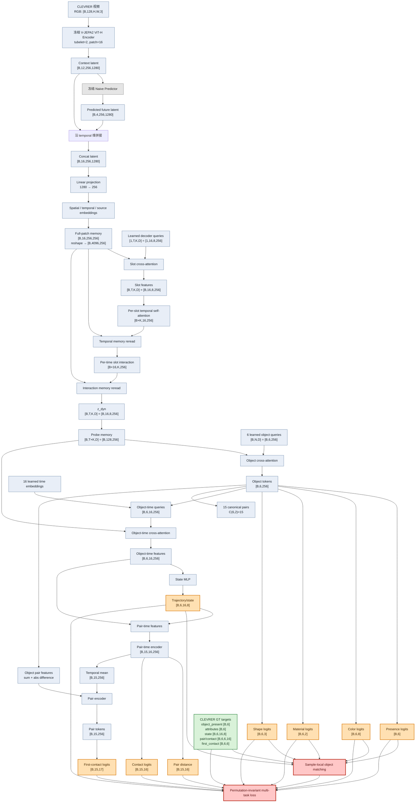

# 当前框架与 Loss 路径

本文档总结当前代码实际执行的 `V-JEPA2 -> UniversalDynamicsDecoder -> CLEVRERShallowProbes` 数据流，并标出参与 `structured_probe_loss` 的分支。

## 维度约定

```text
B：batch size
T：decoder temporal steps，当前 T=16
K：dynamics decoder slots，当前 K=8
N：CLEVRER object slots，当前 N=6
D：decoder hidden dimension，当前 D=256
P：每个 temporal step 的空间 patch 数，P=16×16=256
```

当前 cache 的实际 latent 协议是：

```text
context_tokens: [B, 12, 256, 1280]
future_tokens:  [B,  4, 256, 1280]
tokens:         [B, 16, 256, 1280]
```

predictive 模式的 `source_ids` 为 `[0]*12 + [1]*4`；non-predictive 模式为 `[0]*16`。部分旧文档写成 `8+8` 和 `z_dyn=[B,8,8,256]`，但当前 `cache_full_latents.py`、`model.py` 和 manifest 的实现均对应 `12+4` 与 `z_dyn=[B,16,8,256]`。

## 总体数据流与 Loss



## Loss 分支

object slots 没有固定 CLEVRER object ID。训练前，代码根据 presence、颜色、材质、形状和有效轨迹代价，为每个样本寻找最优 slot permutation；匹配过程在 `no_grad` 下执行。

匹配后计算：

```text
L = L_presence
  + L_attributes
  + 2.0 * L_center
  + 1.0 * L_geometry
  + 0.5 * L_velocity
  + 0.1 * L_log_area
  + 1.0 * L_distance
  + 2.0 * L_contact
  + 1.0 * L_first_contact
```

直接参与 loss 的模型输出为：

```text
presence_logits
color_logits / material_logits / shape_logits
trajectory_2d
pair_distance_2d
contact_gt_event
first_contact_logits
```

`z_dyn`、`object_tokens` 和 `pair_tokens` 是中间表示，不直接计算监督损失，但通过各 prediction head 接收梯度。

## 关键输出

```text
object_tokens:        [B,6,256]
trajectory_2d:        [B,6,16,8]
pair_tokens:          [B,15,256]
pair_distance_2d:     [B,15,16]
contact_gt_event:     [B,15,16]
first_contact_logits: [B,15,17]
```

其中 17 个 first-contact 类别表示 16 个时间 bin 加 1 个 no-contact 类别。QA 导出阶段会冻结该 decoder/probe，并将 object、pair、object-time、pair-time 表示作为结构化 token 接入 QA Transformer。
