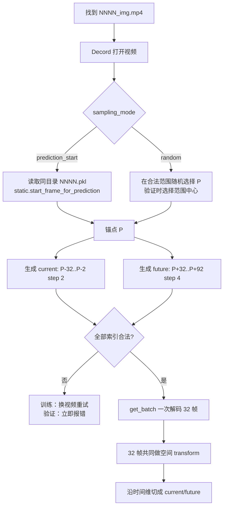

# MP4 帧读取、处理与 16→16 数据协议

## 结论：支持 PKL 边界或随机锚点

采样由四个参数控制：

```yaml
sampling_mode: prediction_start  # prediction_start 或 random
current_frame_step: 2
future_frame_step: 4
clip_gap: 32
```

- `prediction_start`：从同名 PKL 的 `data["static"]["start_frame_for_prediction"]` 读取锚点 `P`；
- `random`：不读取 PKL，在合法范围内随机选择锚点 `P`；
- 验证集在 `random` 模式下使用合法范围中心，保证确定性。

默认索引为：

```text
current = P-32, P-30, ..., P-2       # 16 帧，step=2
future  = P+32, P+36, ..., P+92      # 16 帧，step=4

             current                    future
P-32 ... P-2    │    P    │    P+32 ... P+92
●  ●  ...  ●    │    ▲    │     ●  ●  ...  ●
└── step=2 ─────┘  anchor  └──── step=4 ─────┘
                         clip_gap=32
```

`clip_gap` 定义为锚点 `P` 到 future 首帧的原始帧偏移；current 结束于 `P-current_frame_step`。没有时间插值、帧平均或光流处理。

## 1. 样本格式与索引公式

```python
{
  "current": [C,16,H,W],
  "future": [C,16,H,W],
  "current_indices": [16],
  "future_indices": [16],
  "anchor_frame": scalar,
  "path": str,
}
```

一般形式为：

```text
current_start = P - clip_frames * current_frame_step
current[i]    = current_start + i * current_frame_step
future[i]     = P + clip_gap + i * future_frame_step
             i = 0, ..., clip_frames-1
```

同名 metadata 按 `NNNN_img.mp4 -> NNNN.pkl` 映射。PKL 只在 `prediction_start` 模式读取，并在每个 DataLoader worker 内缓存 `P`。

## 2. 空间增强一致性

current 与 future 的 32 个原始帧一次性交给 transform，再切成两半，因此 random crop、resize 和 flip 完全一致，不会把增强差异误当成运动。

默认训练 transform 的具体顺序：

1. 将 Decord 输出的 RGB `[T,H,W,C]` 数组转换为 `float32`；
2. 调整为 `[C,T,H,W]`；
3. 全部 32 帧共用一个随机裁剪框，面积比例 `[0.8,1.0]`、宽高比 `[0.9,1.1]`；
4. 用双线性插值把空间尺寸缩放为 `256×256`；
5. 以 0.5 概率水平翻转，一次决定应用于全部 32 帧；
6. 使用 ImageNet mean/std 逐通道归一化；
7. 最后才在时间维第 16 帧后切开。

默认 `motion_shift=false`、`auto_augment=false`、`reprob=0.0`，所以没有移动裁剪框、RandAugment 或 Random Erasing。双线性插值只用于空间缩放，不会在时间维补帧。

验证不翻转，使用 `scale=[1,1]`、`ratio=[1,1]`：非正方形输入会居中裁成正方形再缩放，正方形输入相当于整帧缩放。

```text
32 个索引帧 [T,H,W,C]
          │
          ▼
共同 crop/resize ── 共同 flip 决策 ── 共同 normalize
          │
          ▼
       [C,32,256,256]
          │ 时间维切半
          ├──────────────────┐
          ▼                  ▼
 current [C,16,256,256]   future [C,16,256,256]
```

## 3. 从 MP4 到 batch 的完整流程



设视频总帧数为 `N=len(reader)`，合法锚点范围为：

```text
min_P = clip_frames * current_frame_step
max_P = N - 1 - clip_gap - (clip_frames - 1) * future_frame_step

默认：min_P=32, max_P=N-93
```

所以默认仍至少需要 125 帧。`prediction_start` 要求 PKL 中的 `P` 落在该范围；`random` 从该范围选择 `P`。

## 4. 训练与验证采样

- `prediction_start`：训练和验证均使用各自 PKL 给出的固定 `P`；
- `random`：训练随机选 `P`，验证使用合法范围中心；
- 太短、损坏、缺少 PKL/key 或 `P` 越界的视频，训练会换样重试，最多 20 次；
- 支持 `root+split+glob` 或一列视频路径的 manifest，并自动去重。
- 指定 `root` 时 split 目录必须真实存在；拼写错误会立即报错，不会回退扫描整个数据根目录。
- 验证样本损坏或过短时立即失败，避免静默换样造成重复计数。

`current_indices` 和 `future_indices` 保留 MP4 原始帧索引，可直接检查某个 batch 实际取了哪些帧。

## 5. 默认目录

```yaml
data:
  root: /data/ABDUCTIVE-WORLD/physion_v2/extracted
  train_split: data_v1
  eval_split: readout_data_v1
  video_glob: "**/*_img.mp4"
```

## 6. 泄漏约束

`prediction_start` 只读取 PKL 中的时间边界 `static.start_frame_for_prediction`，不读取接触标签、物理属性或未来碰撞信息。不使用 test 选 epoch/超参数；最终 OCP readout 应只用 readout split 拟合、test split 报告。

## 7. 对应代码

- 索引、解码、共同 transform 和切分：`recipe/vjepa2_naive/dataset.py`
- 训练/验证 transform 与 deterministic 开关：`recipe/vjepa2_naive/train.py`
- crop、flip、normalize：`app/vjepa/transforms.py`
- 默认参数：`recipe/vjepa2_naive/configs/physionpp/physion-vith-16to16-{4gpu,8gpu}.yaml`
