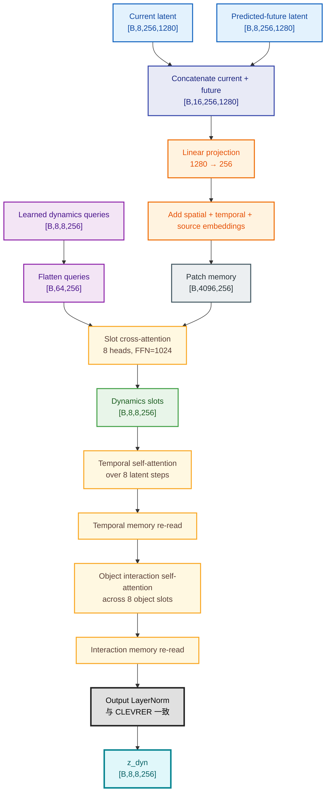
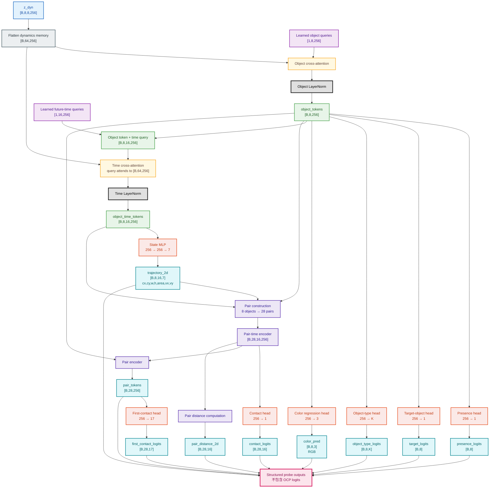
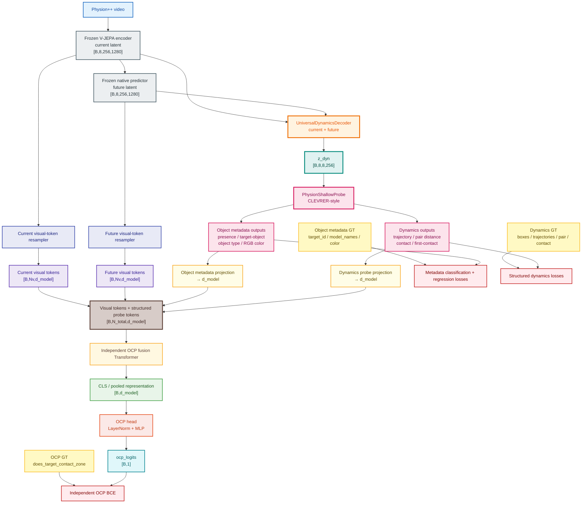

删掉以下四类监督：

```text
mass_pred
friction_pred
bounciness_pred
scale_pred
```

保留的 Physion++ object-level 标签为：

```text
presence
is_target
object_type
color（RGB）
```

下面是更新后的架构。

## 1. Decoder



## 2. Physion++ Shallow Probe



## 3. 整体架构



更新后的 object-level supervision 为：

```text
presence_logits       [B,8]
target_logits         [B,8]
object_type_logits    [B,8,K]
color_pred            [B,8,3]
```

不再包含：

```text
mass_pred
friction_pred
bounciness_pred
scale_pred
```

Physion++ 和 CLEVRER 的主要差别现在只在于：

```text
CLEVRER:
color / material / shape

Physion++:
target-object / object type / RGB color
```